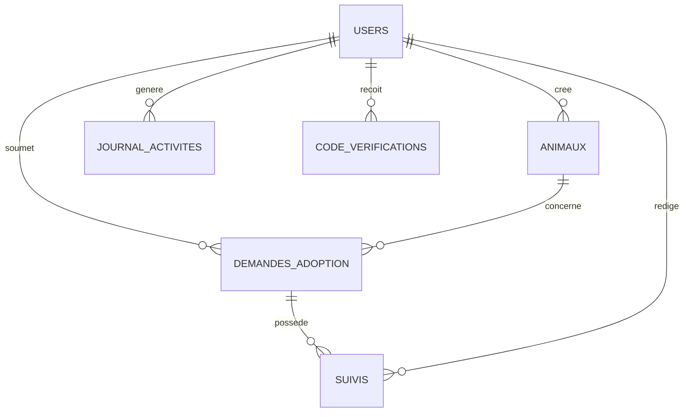

# Schéma de la base de données

## Contexte
Ce document décrit la structure relationnelle actuelle du projet Laravel pour le point 2 (Base de données & Migrations).

## Tables principales
- `users`: comptes applicatifs (admin, manager, client)
- `animaux`: entité principale des animaux
- `demandes_adoption`: demandes d'adoption liées à un utilisateur et un animal
- `suivis`: suivi métier d'une demande d'adoption
- `journal_activites`: traçabilité des actions
- `code_verifications`: codes de vérification (OTP)

## Relations (clés étrangères)
- `animaux.cree_par_utilisateur_id -> users.id`
- `demandes_adoption.utilisateur_id -> users.id`
- `demandes_adoption.animal_id -> animaux.id`
- `suivis.utilisateur_id -> users.id`
- `suivis.demande_adoption_id -> demandes_adoption.id`
- `journal_activites.utilisateur_id -> users.id`
- `code_verifications.user_id -> users.id`

## Diagramme relationnel


## Normalisation
- Les données utilisateurs sont centralisées dans `users`.
- Les informations d'adoption sont séparées en `demandes_adoption`.
- Le suivi métier (`suivis`) est séparé des demandes pour éviter les colonnes répétées ou multi-valeurs.
- La traçabilité (`journal_activites`) et la vérification (`code_verifications`) sont isolées pour garder des responsabilités de table claires.

## Validation rapide
Commande recommandée:
```bash
php artisan migrate:fresh --seed --force
```
Cette commande reconstruit entièrement la base via migrations et injecte les données de test via seeders.
